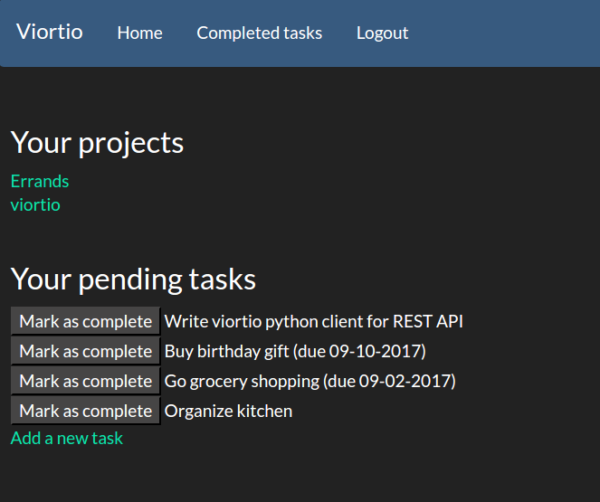

# viortio

Viortio is a simple to-do app I wrote to learn Flask. A lot of this was adapted from [Miguel Grinberg's Flask mega tutorial](https://blog.miguelgrinberg.com/post/the-flask-mega-tutorial-part-i-hello-world).

### Features

Beyond the basic features of adding/completing tasks, viortio has some extra features:

* User accounts
* Ability to group tasks into projects
* Adding due dates
* Adding a date to start showing the task
* A REST API

